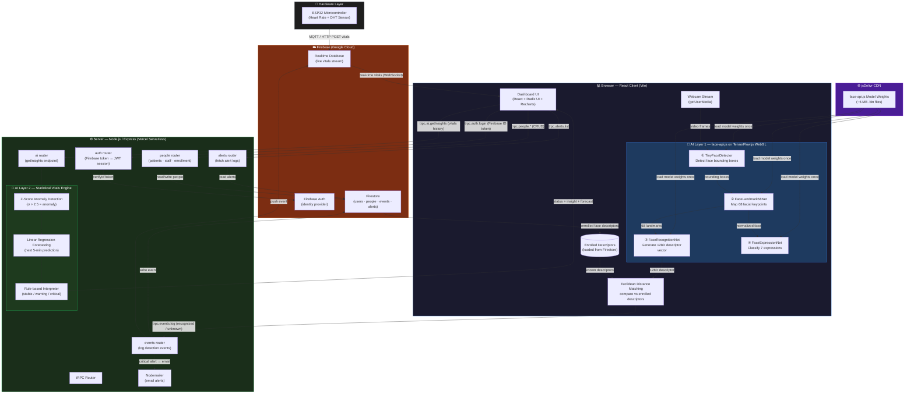
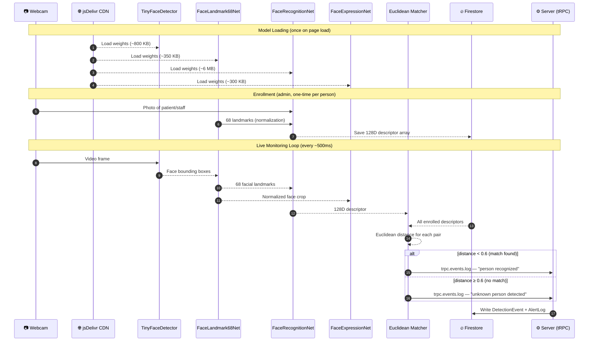
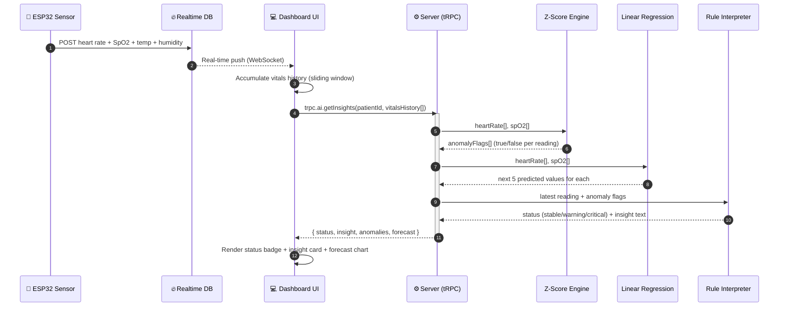

# 🏥 Hospital Monitoring System

A real-time hospital monitoring platform built with React, Node.js/Express, tRPC, Firebase, and on-device AI for face recognition and patient vitals analysis.

---

## 📋 Table of Contents

- [Overview](#overview)
- [🗺️ System Architecture](#️-system-architecture)
- [🤖 AI Models & How They Work](#-ai-models--how-they-work)
  - [1. TinyFaceDetector](#1-tinyfacedetector)
  - [2. FaceLandmark68Net](#2-facelandmark68net)
  - [3. FaceRecognitionNet](#3-facerecognitionnet)
  - [4. FaceExpressionNet](#4-faceexpressionnet)
  - [5. Statistical Vitals AI Engine](#5-statistical-vitals-ai-engine)
- [🏗️ Tech Stack](#️-tech-stack)
- [⚙️ Environment Variables](#️-environment-variables)
- [🚀 Running Locally](#-running-locally)

---

## Overview

The Hospital Monitoring System enables real-time patient monitoring through:
- **Face recognition** to verify patient/staff presence in rooms
- **IoT vitals streaming** (heart rate, SpO2, temperature, humidity) via ESP32 sensors
- **AI-driven clinical insights** to detect anomalies and forecast vital trends
- **Role-based access** for Admins, Doctors, Nurses, and Patients

---

## 🗺️ System Architecture

### Full System Data Flow



---

### 🤖 AI Call Sequence — Face Recognition



---

### 🤖 AI Call Sequence — Vitals Analysis



---


---

## 🤖 AI Models & How They Work

This project uses **two distinct AI systems**: an on-device face recognition pipeline powered by deep learning neural networks, and a server-side statistical inference engine for patient vitals analysis. **No external AI API calls are made** — all inference happens either in the user's browser or on the application server.

---

### 1. TinyFaceDetector

| Property | Details |
|---|---|
| **Library** | `face-api.js` v0.22.2 ([@vladmandic](https://github.com/vladmandic/face-api) fork) |
| **Runtime** | TensorFlow.js v4.22.0 with WebGL backend |
| **Where it runs** | ✅ **Client-side — in the browser (WebGL GPU)** |
| **Model weights hosted at** | `https://cdn.jsdelivr.net/npm/@vladmandic/face-api/model/` (jsDelivr CDN) |

**What it does:**
TinyFaceDetector is a lightweight, fast Convolutional Neural Network (CNN) that scans each video frame from the room camera to detect bounding boxes around all visible faces. It is optimized for real-time use — running every few hundred milliseconds on a live webcam stream — while being small enough to load over the network and execute entirely in the browser.

**How it works in this project:**
```
Live webcam video frame
        ↓
TinyFaceDetector (CNN)
        ↓
Bounding boxes for each detected face
        ↓
Passed to FaceLandmark68Net + FaceRecognitionNet
```

---

### 2. FaceLandmark68Net

| Property | Details |
|---|---|
| **Library** | `face-api.js` v0.22.2 |
| **Runtime** | TensorFlow.js v4.22.0 with WebGL backend |
| **Where it runs** | ✅ **Client-side — in the browser (WebGL GPU)** |
| **Model weights hosted at** | `https://cdn.jsdelivr.net/npm/@vladmandic/face-api/model/` (jsDelivr CDN) |

**What it does:**
FaceLandmark68Net is a neural network that maps 68 precise facial keypoints (eyes, nose, mouth, jawline, eyebrows) onto each detected face bounding box. These landmarks are used to normalize the face geometry before it is passed to the recognition network, significantly improving accuracy regardless of pose or lighting changes.

**How it works in this project:**
```
Face bounding box (from TinyFaceDetector)
        ↓
FaceLandmark68Net
        ↓
68 facial landmark coordinates
        ↓
Face geometry normalization
        ↓
Input for FaceRecognitionNet
```

---

### 3. FaceRecognitionNet

| Property | Details |
|---|---|
| **Library** | `face-api.js` v0.22.2 |
| **Architecture** | ResNet-34 inspired deep CNN |
| **Output** | 128-dimensional face embedding (descriptor vector) |
| **Runtime** | TensorFlow.js v4.22.0 with WebGL backend |
| **Where it runs** | ✅ **Client-side — in the browser (WebGL GPU)** |
| **Model weights hosted at** | `https://cdn.jsdelivr.net/npm/@vladmandic/face-api/model/` (jsDelivr CDN) |

**What it does:**
FaceRecognitionNet is the core identity model. It takes a normalized face crop and outputs a 128-number vector (a "face descriptor") that uniquely encodes the person's facial features. Two photos of the same person will produce very similar vectors; photos of different people will produce very different vectors. Identity matching is done by computing the **Euclidean distance** between two descriptors — a distance below `0.6` is treated as a match (≥60% confidence).

**How it works in this project:**

*Enrollment (one-time setup per person):*
```
Admin uploads a clear photo of patient/staff
        ↓
FaceRecognitionNet generates a 128D descriptor
        ↓
Descriptor saved to Firebase Firestore (as a number array)
```

*Live recognition (continuous during monitoring):*
```
New face detected in the video stream
        ↓
FaceRecognitionNet generates a 128D descriptor
        ↓
Euclidean distance compared against all enrolled descriptors
        ↓
If distance < 0.6 → Patient/Staff recognized ✅
If distance ≥ 0.6 → Unknown person ⚠️
        ↓
Event logged to Firebase + alert triggered if unauthorized
```

---

### 4. FaceExpressionNet

| Property | Details |
|---|---|
| **Library** | `face-api.js` v0.22.2 |
| **Output** | Probability scores for 7 expressions (happy, sad, angry, fearful, disgusted, surprised, neutral) |
| **Runtime** | TensorFlow.js v4.22.0 with WebGL backend |
| **Where it runs** | ✅ **Client-side — in the browser (WebGL GPU)** |
| **Model weights hosted at** | `https://cdn.jsdelivr.net/npm/@vladmandic/face-api/model/` (jsDelivr CDN) |

**What it does:**
FaceExpressionNet classifies the emotional expression on each detected face into one of 7 categories. It is loaded alongside the other models but is available for use in future features such as patient distress detection or well-being monitoring.

---

### 5. Statistical Vitals AI Engine

| Property | Details |
|---|---|
| **Type** | Custom rule-based + statistical algorithm (no external AI API) |
| **Where it runs** | ✅ **Server-side — Node.js / Express on Vercel** |
| **Endpoint** | `trpc.ai.getInsights` |
| **External API** | ❌ None — fully self-contained |

**What it does:**
This is the project's server-side intelligence layer. It analyzes a patient's historical vitals (heart rate, SpO2) and produces clinical insights, anomaly flags, and short-term forecasts. It consists of three algorithms working in sequence:

#### Algorithm 1 — Z-Score Anomaly Detection
```
Collect last N readings of Heart Rate / SpO2
        ↓
Calculate mean (μ) and standard deviation (σ)
        ↓
For each reading: Z-Score = |value − μ| / σ
        ↓
If Z-Score > 2.5 → reading is flagged as an anomaly
```
Detects sudden spikes or drops that deviate significantly from the patient's own recent baseline — more personalized than fixed clinical thresholds.

#### Algorithm 2 — Linear Regression Forecasting
```
Take the sequence of recent vitals readings
        ↓
Fit a least-squares linear regression line: y = slope·x + intercept
        ↓
Extrapolate 5 future data points (≈ next 5 minutes)
        ↓
Return predicted Heart Rate and SpO2 trend
```
Provides short-term trend forecasting to help clinicians anticipate deterioration before it becomes critical.

#### Algorithm 3 — Rule-based Clinical Interpretation
```
Latest SpO2 < 94% OR anomaly detected → Status: WARNING
Heart Rate > 110 BPM or < 50 BPM OR anomaly → Status: WARNING
Heart Rate > 130 BPM → Status: CRITICAL
SpO2 < 90% → Status: CRITICAL (immediate assessment required)
All within range → Status: STABLE
```
Translates the raw numbers and anomaly flags into a human-readable clinical status and actionable insight message displayed on the dashboard.

---

## 🏗️ Tech Stack

| Layer | Technology |
|---|---|
| **Frontend** | React 19, TypeScript, Vite, TailwindCSS v4, Radix UI, Recharts |
| **Backend** | Node.js, Express, tRPC v11 |
| **Database** | Firebase Firestore (persistent data) + Firebase Realtime Database (live events) |
| **Authentication** | Firebase Authentication + JWT session cookies |
| **AI — Face Recognition** | face-api.js + TensorFlow.js (WebGL, runs in browser) |
| **AI — Vitals Analysis** | Custom statistical engine (runs on server) |
| **IoT Hardware** | ESP32 microcontroller (heart rate sensor, DHT sensor) |
| **Deployment** | Vercel (serverless) |
| **Email Alerts** | Nodemailer |

---

## ⚙️ Environment Variables

Create a `.env` file at the project root with the following:

```env
# Firebase Client (public)
VITE_FIREBASE_API_KEY=
VITE_FIREBASE_AUTH_DOMAIN=
VITE_FIREBASE_PROJECT_ID=
VITE_FIREBASE_STORAGE_BUCKET=
VITE_FIREBASE_MESSAGING_SENDER_ID=
VITE_FIREBASE_APP_ID=
VITE_FIREBASE_DATABASE_URL=

# Firebase Admin (server-side, keep secret)
FIREBASE_SERVICE_ACCOUNT=   # base64-encoded service account JSON

# App Config
OWNER_OPENID=               # Firebase UID of the admin user
COOKIE_SECRET=              # Random secret for JWT session signing

# Email Alerts
EMAIL_USER=
EMAIL_PASS=
NOTIFICATION_EMAIL=
```

> ⚠️ **Never commit `.env` to Git.** The `FIREBASE_SERVICE_ACCOUNT` and `COOKIE_SECRET` are sensitive credentials.

---

## 🚀 Running Locally

```bash
# Install dependencies
pnpm install

# Start development server (frontend + backend)
pnpm dev
```

The app runs at `http://localhost:5000` by default.

```bash
# Run tests
pnpm test

# Type-check
pnpm check

# Production build
pnpm build
```
