# Figures and Diagrams

# Figure 2.1 — System Context Diagram

Insert in: Section 2.1 (System Description)

Purpose:
Shows actors, system boundary, and cloud integrations.

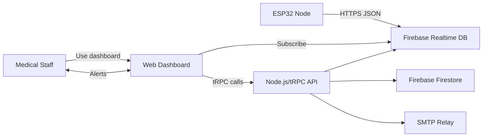

# Figure 3.1 — Global Architecture Diagram

Insert in: Section 3.1 (Global Architecture Diagram)

Purpose:
Shows the five-layer system architecture and data flow.

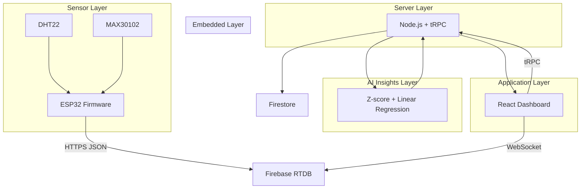

# Figure 3.1b — End-to-End System Diagram (ESP32 to Dashboard + RBAC + Alerts)

Insert in: Section 3.1 (Global Architecture Diagram)

Purpose:
Show the complete system flow from ESP32 to dashboard, including RBAC and alerts.

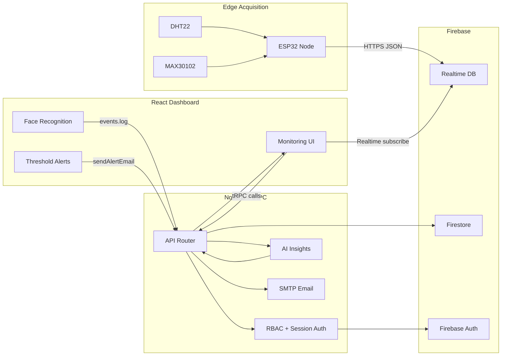

# Figure 3.2 — Functional Architecture

Insert in: Section 3.2 (Functional Architecture)

Purpose:
Breaks down functional modules and interfaces.

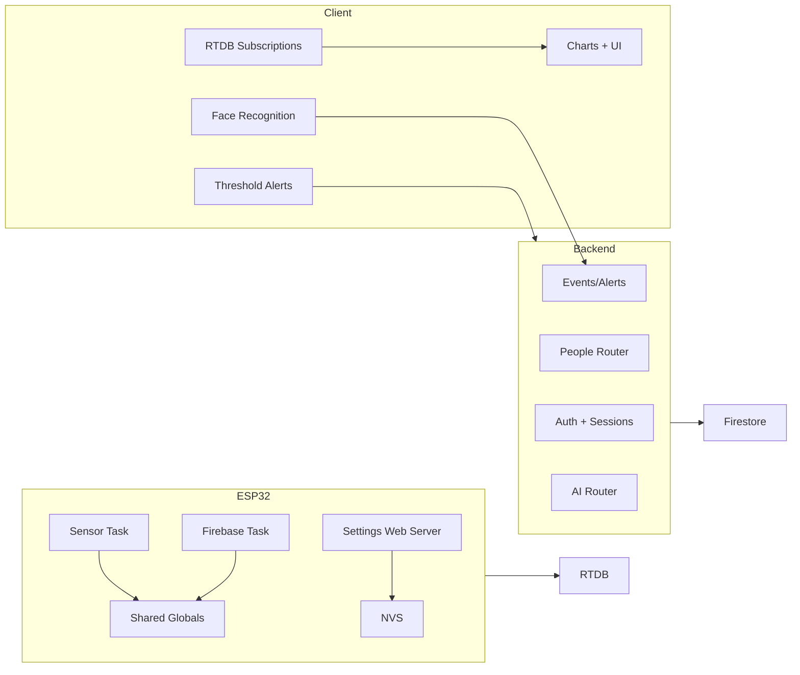

# Figure 3.3 — Hardware Architecture

Insert in: Section 3.3 (Hardware Architecture)

Purpose:
Shows hardware components and buses.

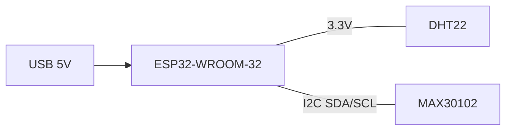

# Figure 3.4 — Software Architecture

Insert in: Section 3.5 (Software Architecture)

Purpose:
Shows module boundaries and data stores.

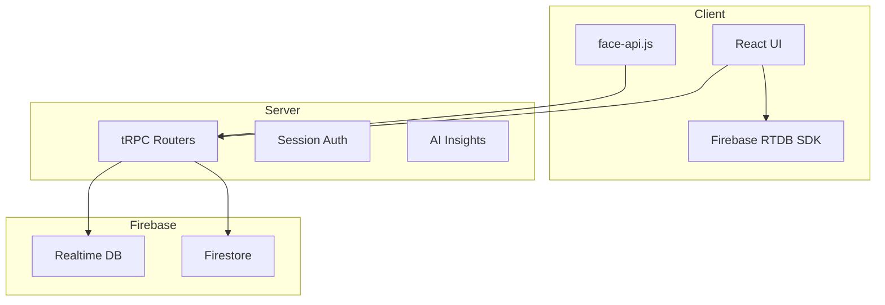

# Figure 3.5 — Processing Pipeline

Insert in: Section 3.6 (Processing Pipeline)

Purpose:
End-to-end telemetry flow and AI call sequence.

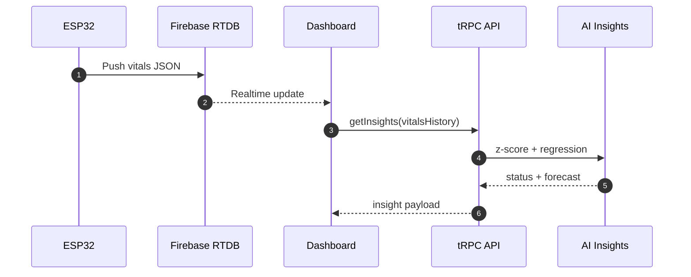

# Figure 3.6 — Database Structure

Insert in: Section 3.5 (Software Architecture) or Section 2.5 (Inputs/Outputs)

Purpose:
Document Firestore collections and RTDB paths.

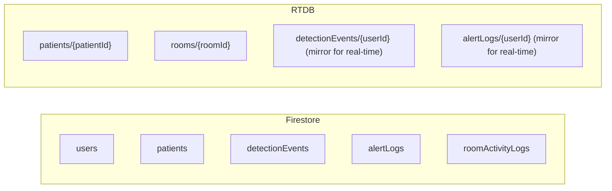

# Figure 3.7 — Face Recognition Pipeline

Insert in: Section 3.5 (Software Architecture) or Section 4 (Methodology)

Purpose:
Show the browser-based face recognition flow and alert generation.

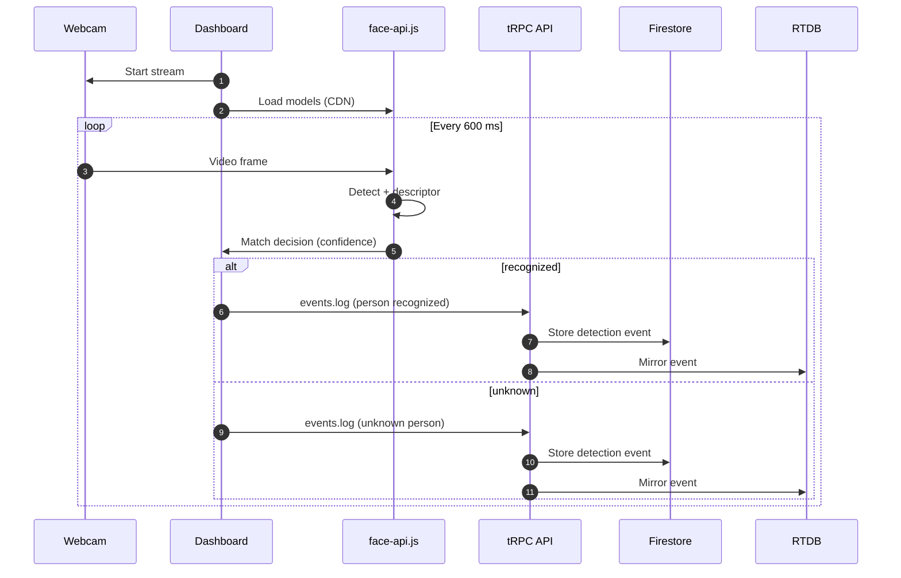

# Figure 4.1 — Methodology Workflow

Insert in: Section 4.2 (Methodology Diagram)

Purpose:
Visualize the required flow: problem → design → implementation → validation → analysis.

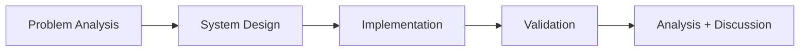

# Figure 5.1 — Backend Service Overview

Insert in: Section 5.1 (System Overview)

Purpose:
Shows backend components and data integrations.

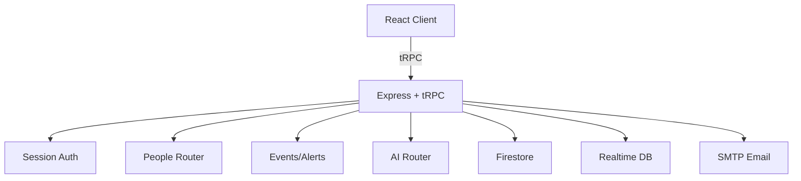

# Figure 5.2 — Hardware Wiring/Schematics

Insert in: Section 5.4 (Hardware Schematics)

Purpose:
Provide exact wiring between ESP32, DHT22, and MAX30102.

Mermaid is insufficient for a true schematic. The figure should include:

- ESP32-WROOM-32 pinout (3.3V, GND, GPIO4, GPIO21, GPIO22)
- DHT22 with VCC, GND, DATA to GPIO4
- MAX30102 with VCC, GND, SDA to GPIO21, SCL to GPIO22
- Pull-up resistors on SDA, SCL, and INT (value labeled)
- Common 3.3V rail and ground

# Figure 6.1 — Validation Pipeline

Insert in: Section 6.1 (Experimental Protocol)

Purpose:
Show the validation workflow across subsystems.

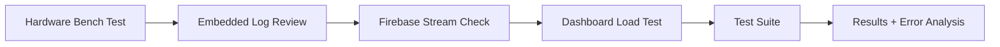

# Figure 6.2 — ESP32 Communication Flow

Insert in: Section 6.2 or 5.6

Purpose:
Visualize Wi-Fi states and Firebase task behavior.

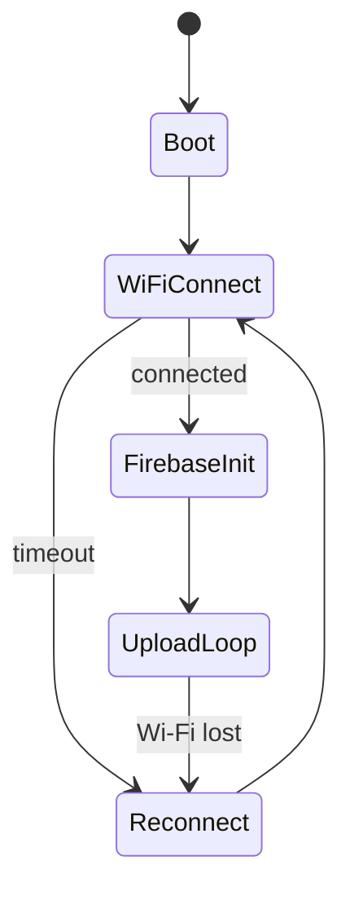

# Figure 9.1 — AI Pipeline

Insert in: Section 9 (AI Predictive Analytics)

Purpose:
Describe AI processing steps and outputs.

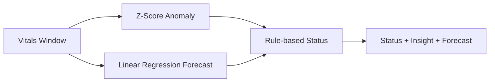

# Figure 9.2 — AI Insights UI

Insert in: Section 9 (AI Predictive Analytics)

Purpose:
Mock the UI block that displays AI status, insight text, and forecast graph.

Mermaid is not suitable for UI layout. The figure should include:

- Status badge (stable/warning/critical)
- Insight text block
- Mini chart with 5-step forecast overlay
- Timestamp of last inference

# Use Case Diagrams

Insert in: Section 2.2 (Use Cases)

Purpose:
Visualizes the interactions between actors and the system across all subsystems.

## Figure 2.2 — Embedded Subsystem Use Cases
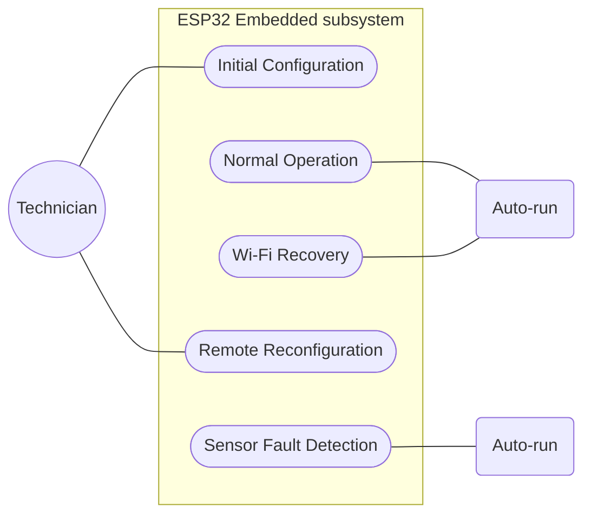

## Figure 2.3 — Backend and Dashboard Use Cases
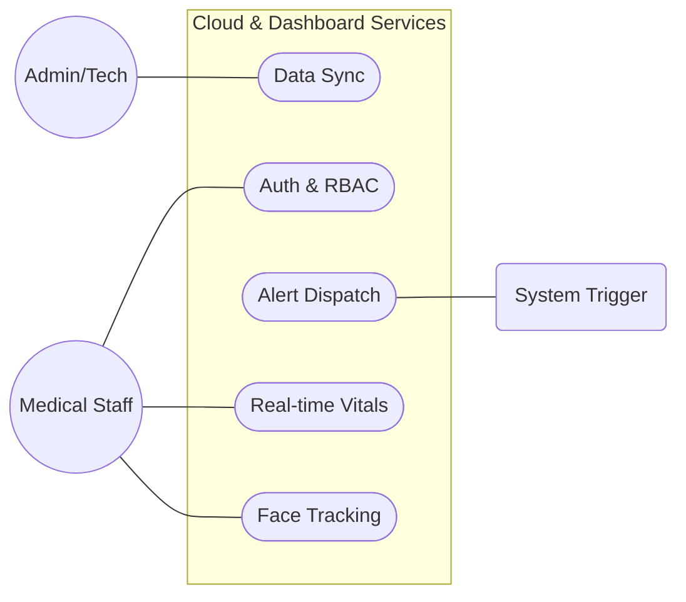

## Figure 2.4 — AI Subsystem Use Cases
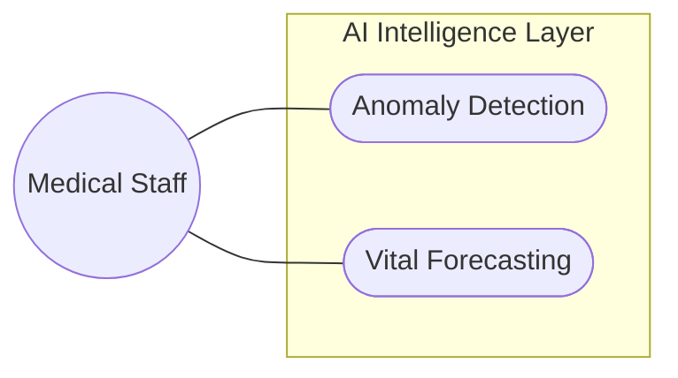
